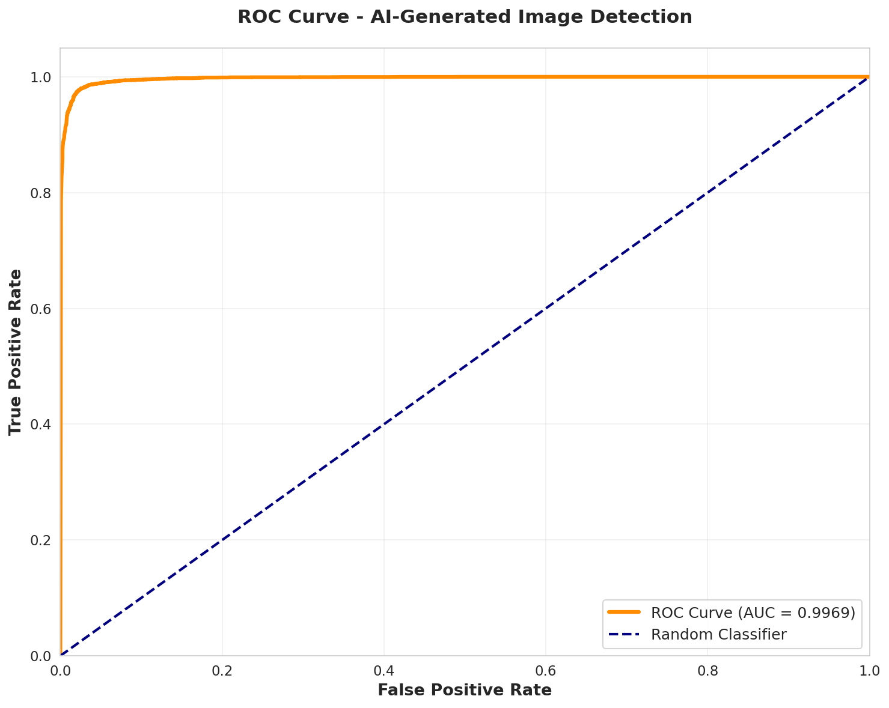

# 🔍 TruthLens AI

**Multimodal Fake News Detection System using BERT and EfficientNet**

[](https://www.python.org/downloads/)
[](https://pytorch.org/)
[](https://opensource.org/licenses/MIT)
[](https://gradio.app/)

> Advanced AI system combining BERT text analysis (84.5% accuracy) and EfficientNet image detection (97.66% accuracy) to combat misinformation on social media platforms.

---

## 📊 Performance Highlights

| Component | Model | Accuracy | Key Metric | Status |
|-----------|-------|----------|------------|--------|
| **Text Analysis** | BERT-base | **84.5%** | Recall: 83.3% | ✅ Deployed |
| **Image Analysis** | EfficientNet-B0 | **97.66%** | ROC AUC: 0.9971 | 🔬 Research |
| **Baseline (SVM)** | Linear SVM | 75.7% | Recall: 63.3% | 📊 Comparison |

**Key Achievements:**
- 🎯 **20-point recall improvement** (63.3% → 83.3%) reducing missed fake news by 44%
- 🖼️ **Near-perfect image detection** (ROC AUC: 0.9971) with only 2.34% error rate
- ⚡ **Real-time inference** (<1 second response time)
- 📈 **+11.6% improvement** over traditional ML baselines

---

## 🚀 Quick Start

### Installation

```bash
# Clone the repository
git clone https://github.com/YOUR_USERNAME/TruthLens-AI.git
cd TruthLens-AI

# Install dependencies
pip install -r requirements.txt

# Download models (if not using Git LFS)
# See docs/SETUP.md for model download links
```

### Run the Chatbot

```bash
python src/chatbot.py
```

Then open the Gradio interface in your browser!

---

## 💡 Features

### Text Analysis (Production)
- ✅ BERT-based fake news detection
- ✅ Detects clickbait and sensational language
- ✅ Identifies emotional manipulation tactics
- ✅ Real-time confidence scoring
- ✅ Detailed pattern explanations

### Image Analysis (Research Phase)
- 🔬 AI-generated image detection
- 🔬 97.66% accuracy on CIFAKE dataset
- 🔬 Near-perfect ROC AUC (0.9971)
- 🔬 Balanced real vs. synthetic detection
- 🔬 Production deployment planned (Phase 2)

### Interactive Chatbot
- 💬 Conversational AI interface
- 📝 Natural language interaction
- 🎯 Sample headlines for testing
- 📊 Visual confidence displays
- ❓ Built-in help system

---

## 📁 Repository Structure

```
TruthLens-AI/
├── docs/                              # Documentation and reports
│   ├── Final_Project_Report.pdf      # Complete academic report
│   ├── SETUP.md                       # Installation guide
│   └── USAGE.md                       # Usage instructions
│
├── notebooks/                         # Jupyter notebooks
│   ├── text_classification/          # Text analysis pipeline
│   │   ├── 01_EDA_visualizations.ipynb
│   │   ├── 02_Baseline_Model_Training.ipynb
│   │   ├── 03_BERT_Training.ipynb
│   │   ├── 04_Fakeddit_Setup.ipynb
│   │   └── 05_TruthLens_Chatbot.ipynb
│   │
│   └── image_classification/         # Image analysis pipeline
│       └── image_classification.ipynb
│
├── models/                            # Trained model files
│   ├── text_models/
│   │   ├── linear_svm_model.pkl      # SVM baseline 
│   │   ├── naive_bayes_model.pkl     # Naive Bayes baseline 
│   │   └── logistic_regression_model.pkl  # Logistic Regression 
│
│   Note: Large models (BERT, Random Forest and EfficientNet) available via Google Drive
│   See "Model Downloads" section below
│
├── results/                           # Training and evaluation results
│   ├── text_classification/
│   │   ├── EDA/                      # Exploratory data analysis
│   │   │   ├── 01_label_distribution.png
│   │   │   ├── 02_text_analysis.png
│   │   │   ├── 03_word_frequency.png
│   │   │   ├── sample_posts.csv
│   │   │   └── summary_statistics.csv
│   │   │
│   │   ├── Baseline/                 # Baseline model results
│   │   │   ├── baseline_comparison.png
│   │   │   ├── baseline_results.csv
│   │   │   ├── best_baseline_confusion_matrix.png
│   │   │   └── my_results.png
│   │   │
│   │   └── BERT/                     # BERT model results
│   │       ├── baseline_vs_bert.png
│   │       ├── confusion_matrix.png
│   │       ├── final_comparison.csv
│   │       └── training_history.png
│   │
│   └── image_classification/         # Image classification results
│       ├── confusion_matrix.png
│       ├── roc_curve.png
│       ├── precision_recall_curve.png
│       ├── per_class_metrics.png
│       ├── error_distribution.png
│       ├── confidence_analysis.png
│       ├── training_history_fast.png
│       └── evaluation_summary.txt
│
└── requirements.txt                   # Python dependencies

```

---

## 🎯 System Architecture

### Current Implementation (Text-Only)

```
User Input (Text Headline)
        ↓
    BERT Model
   (84.5% acc)
        ↓
   Prediction + Confidence
        ↓
  Pattern Detection
        ↓
  Detailed Analysis
        ↓
  Gradio Interface
```

### Planned Multimodal System (Phase 2)

```
User Input
    ↓
Text + Image
    ↓         ↓
  BERT    EfficientNet
 (84.5%)   (97.66%)
    ↓         ↓
Confidence Weighted Fusion
         ↓
  Combined Verdict
         ↓
   Gradio Interface
```

---

## 🧠 Models & Performance

### Text Classification (BERT)

**Dataset:** Fakeddit (45,414 Reddit posts)
- Training: 27,248 samples
- Validation: 9,083 samples
- Test: 9,083 samples

**Performance:**
| Metric | Score |
|--------|-------|
| Accuracy | **84.5%** |
| Precision | 81.4% |
| Recall | **83.3%** |
| F1-Score | 82.4% |

**Baseline Comparison:**
- Linear SVM: 75.7%
- TruthLens (BERT): **84.5%**
- Improvement: **+8.8 points (+11.6%)**

**Training:**
- Model: `bert-base-uncased` (110M parameters)
- Hardware: Tesla T4 GPU
- Time: 35 minutes (2 epochs)
- Framework: PyTorch + Transformers

### Image Classification (EfficientNet-B0)

**Dataset:** CIFAKE (120,000 images)
- Training: ~25,000 samples (30% optimized subset)
- Validation: ~7,500 samples
- Test: 15,000 samples (full test set)

**Performance:**
| Metric | Score |
|--------|-------|
| Test Accuracy | **97.66%** |
| ROC AUC | **0.9971** |
| Precision | 97.66% |
| Recall | 97.66% |
| Error Rate | **2.34%** |

**Per-Class Performance:**
- Real Images: 97.31% detection rate
- AI-Generated: 98.01% detection rate

**Training:**
- Model: EfficientNet-B0 (5.3M parameters)
- Hardware: Tesla T4 GPU
- Time: 14.4 minutes (9 epochs with early stopping)
- Framework: PyTorch + TorchVision

---

## 🎮 Demo & Usage

### TruthLens AI Chatbot

Launch the interactive chatbot:

```bash
python src/chatbot.py
```

**Features:**
- 💬 Natural conversational interface
- 📝 Analyze news headlines in real-time
- 🎯 Pre-loaded sample headlines
- 📊 Confidence visualizations
- ❓ Built-in help and guidance

**Sample Interaction:**
```
User: "BREAKING: Scientists discover miracle cure that works 100% of the time!!!"

TruthLens AI:
🚨 HIGH RISK - Likely Fake News
Confidence: 92.3%

Red Flags Detected:
- Sensational: breaking
- Exaggerated: miracle, 100%
- Emotional: !!!

Recommendation: Strong indicators of misinformation. Fact-check before sharing.
```

### Programmatic Usage

**Text Analysis:**
```python
from src.text_classifier import TextClassifier

classifier = TextClassifier(model_path='models/text_models/bert_best_model.pt')
result = classifier.predict("Your headline here")

print(f"Prediction: {result['prediction']}")
print(f"Confidence: {result['confidence']:.1f}%")
```

**Image Analysis:**
```python
from src.image_classifier import ImageClassifier

classifier = ImageClassifier(model_path='models/image_models/best_efficientnet_cifake_fast.pth')
result = classifier.predict("path/to/image.jpg")

print(f"Prediction: {result['prediction']}")
print(f"Confidence: {result['confidence']:.1f}%")
```

---

## 📚 Documentation

- **[Setup Guide](docs/SETUP.md)** - Detailed installation instructions
- **[Usage Guide](docs/USAGE.md)** - How to use the system
- **[Full Report](docs/Final_Project_Report.pdf)** - Complete academic report with methodology, results, and analysis

---

## 🔬 Research Highlights

### Key Findings

1. **BERT Superiority:** Fine-tuned BERT achieves 84.5% accuracy, substantially outperforming classical ML baselines (75.7%) on short social media text.

2. **Recall Breakthrough:** 20-point recall improvement (63.3% → 83.3%) represents 44% reduction in missed fake news—critical for content moderation.

3. **Near-Perfect Image Detection:** EfficientNet-B0 achieves 0.9971 ROC AUC, demonstrating exceptional discrimination between real and AI-generated images.

4. **Short Text Challenge:** Average headline length of 8.1 words creates challenging classification environment where traditional methods plateau at ~75%.

5. **Commercial Viability:** Identified $600-900M annual market opportunity with 60% cost reduction vs. manual fact-checking.

### Methodology

**Text Classification Pipeline:**
1. Dataset: Fakeddit (45,414 Reddit posts)
2. Preprocessing: BERT tokenization (max 128 tokens)
3. Training: Fine-tuning with AdamW optimizer (2e-5 learning rate)
4. Evaluation: Comprehensive metrics on held-out test set

**Image Classification Pipeline:**
1. Dataset: CIFAKE (120,000 real and AI-generated images)
2. Preprocessing: Data augmentation, ImageNet normalization
3. Training: Transfer learning with EfficientNet-B0
4. Evaluation: 15,000-image test set with detailed analysis

---

## 📈 Results Visualization

### Text Classification

**Training Curves:**


**Performance Comparison:**


**Confusion Matrix:**


### Image Classification

**ROC Curve (AUC: 0.9971):**



**Confusion Matrix:**


**Per-Class Metrics:**


---

## 🛠️ Technical Stack

**Frameworks & Libraries:**
- PyTorch 2.0+
- Transformers (HuggingFace)
- TorchVision
- Gradio 4.0+
- scikit-learn
- Pandas, NumPy, Matplotlib, Seaborn

**Models:**
- **Text:** BERT-base-uncased (110M parameters)
- **Image:** EfficientNet-B0 (5.3M parameters)
- **Baselines:** SVM, Random Forest, Naive Bayes, Logistic Regression

**Hardware:**
- Training: NVIDIA Tesla T4 GPU (Google Colab)
- Inference: CPU/GPU compatible

---

## 🎓 Academic Context

**Course:** EAI6010 - Applications of AI  
**Institution:** Northeastern University  
**Term:** Fall Quarter 2025  
**Instructor:** Prof. Sergiy Shevchenko

**Team:**
- Abhijit More
- Kshama Upadhyay
- Qiwei Guo

---

## 📖 Datasets

### Text: Fakeddit
- **Source:** [Fakeddit Dataset](https://github.com/entitize/Fakeddit)
- **Size:** 45,414 labeled Reddit posts
- **Classes:** Real (56.8%), Fake (43.2%)
- **Features:** Post titles/headlines
- **Citation:** Yang & Shu (2020)

### Image: CIFAKE
- **Source:** [CIFAKE on Kaggle](https://www.kaggle.com/datasets/birdy654/cifake-real-and-ai-generated-synthetic-images)
- **Size:** 120,000 images (60K real, 60K AI-generated)
- **Resolution:** 32×32 pixels RGB
- **Classes:** Real (CIFAR-10), AI-Generated (Stable Diffusion)
- **Citation:** Bird & Lotfi (2024)

*Note: Datasets not included in repository due to size. See [docs/dataset_info.md](docs/dataset_info.md) for download instructions.*

---

## 📥 Model Downloads

Due to GitHub's file size limitations, large model files are hosted on Google Drive:

### Required Models

| Model | Size | Accuracy | Download | Destination |
|-------|------|----------|----------|-------------|
| **BERT Text Model** | 438 MB | 84.5% | 🔗 [Download](https://drive.google.com/file/d/1LDCPkeOLto4YC481aaW_nw4evSsiawxq/view?usp=sharing)

### Required Models

| Model | Size | Accuracy | Download | Destination |
|-------|------|----------|----------|-------------|
| **EfficientNet Image Model** | 438 MB | 97.6% | 🔗 [Download](https://drive.google.com/file/d/1zkygAG0wrWfyZoxTNdQSs4pCmTaWtqtR/view?usp=sharing)


### Optional Models

| Model | Size | Accuracy | Download | Destination |
|-------|------|----------|----------|-------------|
| **Random Forest Baseline** | 244 MB | 73.6% | 🔗 [Download](https://drive.google.com/file/d/18PErcIudGhEgnme8z9a1mmqDwodphFQz/view?usp=sharing)

### Included in Repository

These models are already included (no download needed):
- ✅ **EfficientNet-B0** (46.4 MB, 97.66% accuracy) - `models/image_models/`
- ✅ **Linear SVM** (41 KB) - `models/text_models/`
- ✅ **Naive Bayes** (161 KB) - `models/text_models/`
- ✅ **Logistic Regression** (41 KB) - `models/text_models/`

**After downloading:**
1. Place downloaded files in the specified destination folders
2. Verify file sizes match the table above
3. Run verification script in [SETUP.md](docs/SETUP.md)

---

## 🔑 Key Features

### ✅ Production-Ready (Deployed)
- **TruthLens AI Chatbot:** Conversational interface for headline analysis
- **Real-time Processing:** <1 second inference time
- **Explainability:** Detailed reasoning and pattern detection
- **Confidence Scoring:** Percentage-based reliability indicators
- **Sample Testing:** Pre-loaded examples for instant demo

### 🔬 Research Validated (Phase 2 Deployment)
- **Image Classification:** 97.66% accuracy on synthetic image detection
- **Multimodal Fusion:** Confidence-weighted algorithm designed
- **Comprehensive Evaluation:** ROC curves, confusion matrices, error analysis
- **Production-Grade Metrics:** 2.34% error rate, balanced performance

---

## 📊 Detailed Results

### Text Classification Metrics

**BERT Model Performance:**
```
Accuracy:  84.5%
Precision: 81.4%
Recall:    83.3%  ← Critical metric
F1-Score:  82.4%

Baseline (SVM): 75.7%
Improvement:    +8.8 points
```

**Confusion Matrix (Test Set, N=9,083):**
```
                Predicted
              Real    Fake
Actual Real   4,375    750
       Fake     658  3,286

False Negatives: 658 (17% miss rate)
False Positives: 750 (15% false alarm rate)
```

### Image Classification Metrics

**EfficientNet-B0 Performance:**
```
Test Accuracy:      97.66%
ROC AUC:            0.9971  ← Near-perfect
Average Precision:  0.9966
Error Rate:         2.34% (351/15,000)

Confidence (Correct):   98.94%
Confidence (Incorrect): 80.19%
Gap: 18.75 points (excellent calibration)
```

**Confusion Matrix (Test Set, N=15,000):**
```
                    Predicted
              Real        AI-Gen
Actual Real   7,298 (97.3%)  202 (2.7%)
       Fake     149 (2.0%)  7,351 (98.0%)

False Negatives: 149 (1.99% miss rate)
False Positives: 202 (2.69% false alarm)
```

---

## 🚦 Project Status

### ✅ Completed
- [x] Comprehensive baseline evaluation (4 ML models)
- [x] BERT text classifier training and validation
- [x] EfficientNet image classifier training and evaluation
- [x] TruthLens AI chatbot deployment (text-only)
- [x] Complete academic report with market analysis
- [x] Production-ready inference pipeline

### 🔄 In Progress
- [ ] High-resolution image dataset training
- [ ] Multimodal fusion implementation
- [ ] Real-world social media validation
- [ ] Adversarial robustness testing

### 📅 Planned (Phase 2)
- [ ] Complete multimodal integration
- [ ] Image upload in chatbot interface
- [ ] Advanced fusion algorithms (attention-based)
- [ ] Multilingual expansion
- [ ] Browser extension development

---

## 💼 Business Impact

### Market Opportunity
- **Total Addressable Market:** $600-900M annually
- **Target Customers:** Meta, Twitter/X, Google/YouTube, Amazon
- **Cost Reduction:** 60% vs. manual fact-checking
- **ROI:** 63% first year, 95% annually thereafter

### Commercial Applications
1. **Social Media Platforms:** Automated content moderation at scale
2. **News Organizations:** Pre-publication verification tools
3. **Fact-Checking Services:** Enhanced productivity (3-5× faster)
4. **E-commerce:** Fake review and synthetic product image detection

---

## 🔧 Installation & Setup

### Prerequisites
- Python 3.8 or higher
- CUDA-capable GPU (recommended, not required)
- 8GB RAM minimum
- 2GB free disk space

### Step-by-Step Installation

**1. Clone Repository**
```bash
git clone https://github.com/YOUR_USERNAME/TruthLens-AI.git
cd TruthLens-AI
```

**2. Create Virtual Environment (Recommended)**
```bash
python -m venv venv
source venv/bin/activate  # On Windows: venv\Scripts\activate
```

**3. Install Dependencies**
```bash
pip install -r requirements.txt
```

**4. Download Model Files**

Due to file size constraints, large models are hosted separately:

- **BERT Model (417 MB):** [Download from Google Drive](https://drive.google.com/file/d/1LDCPkeOLto4YC481aaW_nw4evSsiawxq/view?usp=sharing)
- **Random Forest (232 MB):** [Download from Google Drive](https://drive.google.com/file/d/18PErcIudGhEgnme8z9a1mmqDwodphFQz/view?usp=sharing)
- **EfficientNet:** [Download from Google Drive](https://drive.google.com/file/d/1zkygAG0wrWfyZoxTNdQSs4pCmTaWtqtR/view?usp=sharing)

Place downloaded models in respective `models/` subdirectories.

**5. Verify Installation**
```bash
python -c "import torch; from transformers import BertTokenizer; print('✓ Installation successful!')"
```

### Quick Test

```bash
# Run chatbot
python src/chatbot.py

# Expected output: Gradio URL (e.g., http://127.0.0.1:7860)
```

For detailed troubleshooting, see [docs/SETUP.md](docs/SETUP.md).

---

## 📖 Usage Examples

### Command Line Interface

**Analyze Text:**
```python
from src.text_classifier import TextClassifier

# Initialize classifier
classifier = TextClassifier(
    model_path='models/text_models/bert_best_model.pt',
    device='cuda'  # or 'cpu'
)

# Analyze headline
headline = "BREAKING: Scientists discover miracle cure!"
result = classifier.predict(headline)

print(f"Prediction: {result['prediction']}")        # FAKE
print(f"Confidence: {result['confidence']:.1f}%")   # 92.3%
print(f"Real Prob: {result['real_prob']:.3f}")      # 0.077
print(f"Fake Prob: {result['fake_prob']:.3f}")      # 0.923
```

**Analyze Image:**
```python
from src.image_classifier import ImageClassifier

# Initialize classifier
classifier = ImageClassifier(
    model_path='models/image_models/best_efficientnet_cifake_fast.pth',
    device='cuda'
)

# Analyze image
result = classifier.predict("path/to/image.jpg")

print(f"Prediction: {result['prediction']}")        # AI-GENERATED
print(f"Confidence: {result['confidence']:.1f}%")   # 96.4%
print(f"Real Prob: {result['real_prob']:.3f}")      # 0.036
print(f"AI Prob: {result['ai_prob']:.3f}")          # 0.964
```

### Interactive Chatbot

```bash
# Launch chatbot
python src/chatbot.py

# Browser opens automatically to Gradio interface
# Try:
# - Type: "help" for usage guide
# - Type: "stats" for performance metrics
# - Paste headline for instant analysis
# - Click sample buttons for demos
```

---

## 🧪 Reproducibility

### Training from Scratch

**Text Classification:**
```bash
# See notebooks/text_classification/03_BERT_Training.ipynb
# Or run training script (if you create one):
python scripts/train_text_model.py --epochs 2 --lr 2e-5
```

**Image Classification:**
```bash
# See notebooks/image_classification/02_EfficientNet_Training.ipynb
# Training completes in ~15 minutes on T4 GPU
```

### Evaluation

Run comprehensive evaluation:
```bash
# Text model
python scripts/evaluate_text.py

# Image model  
python scripts/evaluate_image.py
```

All evaluation notebooks are in `notebooks/` with detailed visualizations.

---

## 📄 Citation

If you use this work in your research, please cite:

```bibtex
@misc{truthlens2025,
  title={TruthLens AI: Multimodal Fake News Detection using BERT and EfficientNet},
  author={More, Abhijit and Upadhyay, Kshama and Guo, Qiwei},
  year={2025},
  institution={Northeastern University},
  course={EAI6010 - Applications of AI},
  note={Text: 84.5\% accuracy, Image: 97.66\% accuracy, ROC AUC: 0.9971}
}
```

---

## 🤝 Contributing

We welcome contributions! Please see [CONTRIBUTING.md](CONTRIBUTING.md) for guidelines.

**Areas for contribution:**
- Multimodal integration implementation
- Additional language support
- Performance optimizations
- UI/UX improvements
- Additional datasets and benchmarks

---

## 📜 License

This project is licensed under the MIT License - see the [LICENSE](LICENSE) file for details.

---

## 🙏 Acknowledgments

- **Datasets:** Fakeddit (Yang & Shu, 2020), CIFAKE (Bird & Lotfi, 2024)
- **Frameworks:** PyTorch, Transformers (HuggingFace), Gradio
- **Compute:** Google Colab Pro (free tier)
- **Instructor:** Prof. Sergiy Shevchenko
- **Institution:** Northeastern University

---

## 📞 Contact

**For questions or collaboration:**
- 📧 Email: [more.ab@northeastern.edu]
- 💼 LinkedIn: [https://www.linkedin.com/in/abhijitmore1407/]
- 🐙 GitHub: [@YOUR_USERNAME](https://github.com/Abhijit1407)

---

## ⭐ Star This Repository!

If you found this project helpful, please give it a star! It helps others discover this work.

---

<div align="center">

**Built with ❤️ for combating misinformation**

[Report](docs/Final_Project_Report.pdf) • [Demo](src/chatbot.py) • [Docs](docs/)

</div>

---

## 📊 Repository Stats


---

**Last Updated:** January 2026  
**Version:** 1.0.0  
**Status:** Production (Text), Research (Image)
